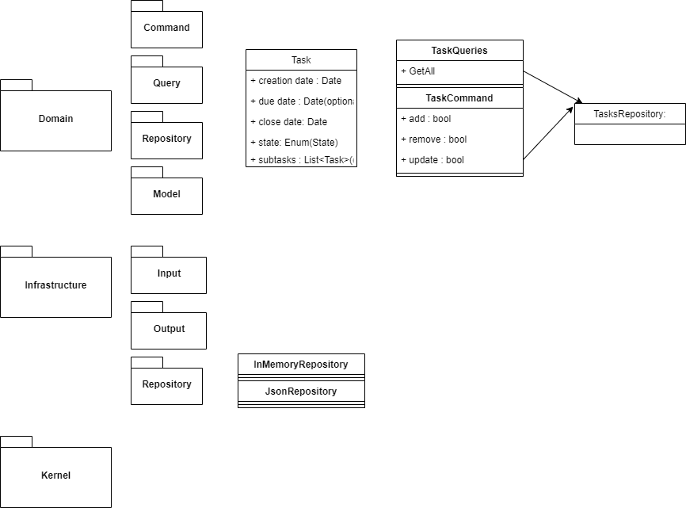

Aloïs Zimmermann-Rosenthal\
Ichaï Chtitski\
Haithem Limam

Notre architecture est une architecture hexagonale. L'application se compose de 3 répertoires principaux : 
- `domain` : contient tout le code métier de l'application, il est isolé de l'infrastructure
- `infra` : contient toutes les fonctionnalités techniques que l'on va plugger dans le code métier 
(par ex : persistance en mémoire ou en fichier json)
- `kernel` : contient le noyau de l'application, avec les interfaces maitresses de l'application

Notre application est également réalisée en CQRS (Command Query Responsibility Segregation). Ainsi, nos commandes
sont dans le répertoire `commands` et nos requêtes dans le répertoire `queries` eux-mêmes présents dans le 
répertoire `domain`.

Afin d'exécuter ce projet, il faut ajouter une variable d'environnement dans "Edit Configurations" : 
`JAVA_TOOL_OPTIONS=--add-opens=java.base/java.time=ALL-UNNAMED`
Il faut également ajouter des paramètres de saisie 
