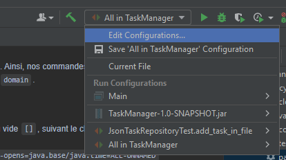
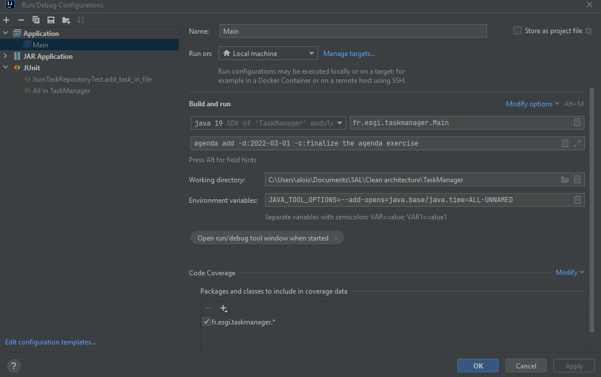
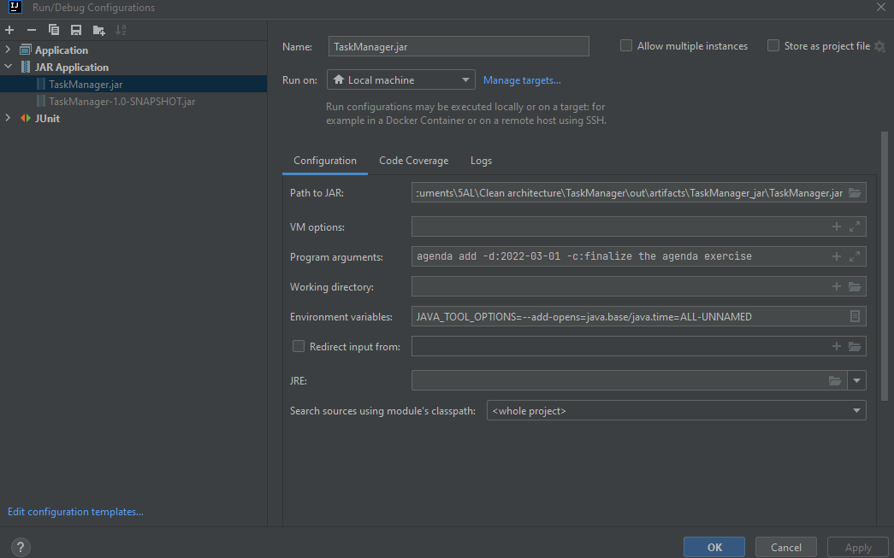

Aloïs Zimmermann-Rosenthal\
Ichaï Chtitski\
Haithem Limam

Notre architecture est une architecture hexagonale. L'application se compose de 3 répertoires principaux : 
- `domain` : contient tout le code métier de l'application, il est isolé de l'infrastructure
- `infra` : contient toutes les fonctionnalités techniques que l'on va plugger dans le code métier 
(par ex : persistance en mémoire ou en fichier json)
- `kernel` : contient le noyau de l'application, avec les interfaces maitresses de l'application

Notre application est également réalisée en CQRS (Command Query Responsibility Segregation). Ainsi, nos commandes
sont dans le répertoire `commands` et nos requêtes dans le répertoire `queries` eux-mêmes présents dans le 
répertoire `domain`.

Afin d'exécuter ce projet, il faut :
- créer un répertoire `~/.consoleagenda/` et y ajouter un fichier `tasks.json` avec un tableau vide `[]`, suivant 
le chemin `C:\Users\{user}\.consoleagenda\tasks.json`
- ajouter une variable d'environnement dans "Edit Configurations" : 
`JAVA_TOOL_OPTIONS=--add-opens=java.base/java.time=ALL-UNNAMED`
  
- ajouter des paramètres de saisie comme `agenda add -d:2022-03-01 -c:finalize the agenda exercise`

Afin d'exécuter les tests, il faut :
- suivre les étapes précédentes et appliquer les variables d'environnement à la configuration de test
- clic droit sur le répertoire `test` et cliquer sur `Run 'All Tests'`

Il existe un fichier jar exécutable disponible dans le répertoire `out/artifacts/consoleagenda_jar`.
La configuation à appliquer pour le jar est la suivante :

